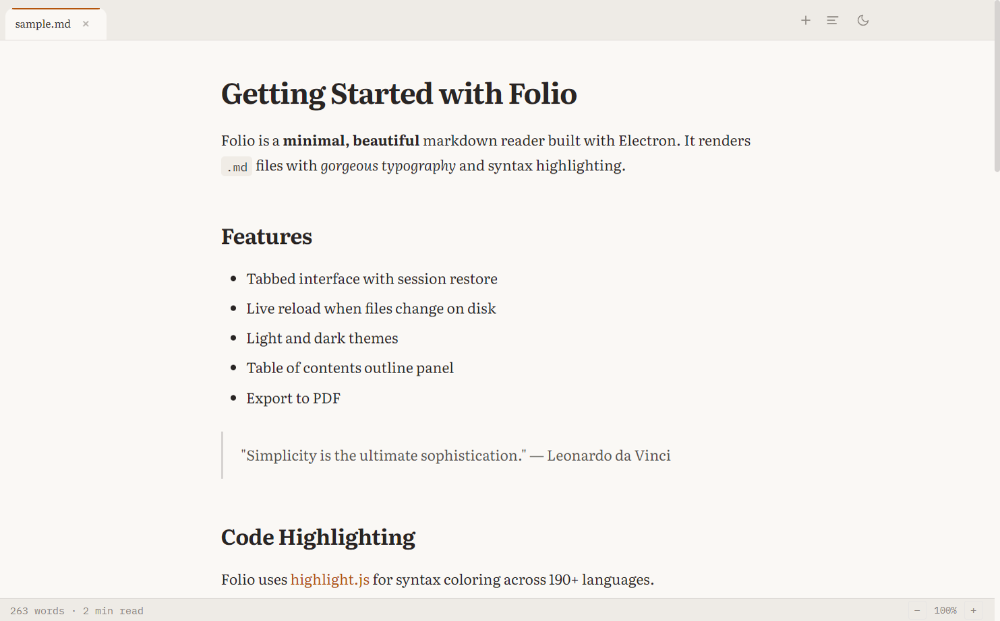
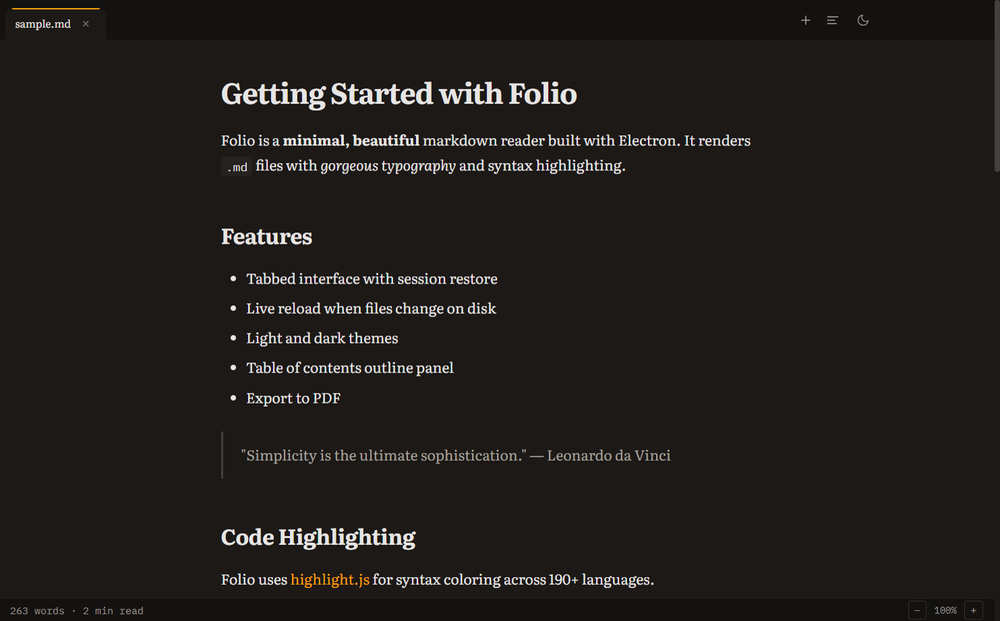

<p align="center">
  
</p>

<h1 align="center">Folio</h1>

<p align="center">
  A desktop app for reading AI-generated markdown.<br>
  Point it at your project folder. It watches for changes and shows you what your agents wrote.
</p>

<p align="center">
  <a href="#quick-start">Quick Start</a>&nbsp;&nbsp;&bull;&nbsp;&nbsp;<a href="#what-it-does">What It Does</a>&nbsp;&nbsp;&bull;&nbsp;&nbsp;<a href="#features">Features</a>&nbsp;&nbsp;&bull;&nbsp;&nbsp;<a href="#keyboard-shortcuts">Shortcuts</a>&nbsp;&nbsp;&bull;&nbsp;&nbsp;<a href="#install">Install</a>
</p>

<br>

<p align="center">
  
</p>

---

You use Claude Code, Cursor, Windsurf, or Copilot. Your agents generate markdown constantly -- `CLAUDE.md`, `AGENTS.md`, planning docs, changelogs, research notes. You need to actually read these files to understand what happened, review decisions, and catch mistakes. Your code editor treats them like any other file. Generic markdown viewers have no idea what `CLAUDE.md` is. So you end up squinting at raw text in a terminal or a cluttered editor tab.

Folio fixes that.

## What It Does

### AI file detection

Folio scans your project tree and finds `CLAUDE.md`, `.cursorrules`, `.windsurfrules`, `AGENTS.md`, `copilot-instructions.md`, and `.clinerules`. These files get a purple badge in the sidebar and sort to the top so you spot them immediately.

<p align="center">
  
</p>

### Cross-file search

Hit `Ctrl+Shift+F` and search across every markdown file in your project. Results are grouped by file with line-level matches. Click any result to jump straight to it.

<p align="center">
  
</p>

### Directory watcher

Point Folio at a folder. When an agent creates or updates a markdown file, it shows up in the sidebar automatically. No manual refresh, no reopening files.

### Tabs with session restore

Open files in tabs. They persist across restarts. Close the app Friday, open it Monday, and your reading session is exactly where you left it.

| Light mode | Dark mode |
|---|---|
|  |  |

## Quick Start

```bash
npx folio-reader --folder ./my-project
```

That's it. Opens Folio with your project's markdown files in the sidebar.

```bash
# Open a specific file
npx folio-reader README.md

# Open a folder and a file
npx folio-reader --folder ./docs README.md

# Just launch the app
npx folio-reader
```

## Features

- AI file badges for `CLAUDE.md`, `.cursorrules`, `.windsurfrules`, `AGENTS.md`, `copilot-instructions.md`, `.clinerules`
- Directory watcher with debounced updates
- Cross-file search with `Ctrl+Shift+F`
- Tabbed reading with session restore
- Outline panel generated from headings -- click to jump
- Dark and light themes (follows system preference)
- Syntax highlighting for fenced code blocks with copy button
- Zoom controls saved across sessions
- Live reload when files change on disk -- scroll position preserved
- PDF export with `Ctrl+P`
- In-document search with `Ctrl+F`
- Word count and reading time in the status bar

## Keyboard Shortcuts

| Shortcut | Action |
|---|---|
| `Ctrl+O` / `Ctrl+T` | Open file |
| `Ctrl+W` | Close tab |
| `Ctrl+Tab` / `Ctrl+Shift+Tab` | Next / previous tab |
| `Ctrl+Shift+T` | Reopen closed tab |
| `Ctrl+F` | Search in document |
| `Ctrl+Shift+F` | Search across all files |
| `Ctrl+P` | Export to PDF |

## Install

### npm (recommended)

```bash
npm install -g folio-reader
folio-reader --folder ./my-project
```

### Download

Grab the latest build from [Releases](https://github.com/BharatBheesetti/Folio/releases):

- **Windows** -- `.exe` installer or portable
- **macOS** -- `.dmg` (x64 and Apple Silicon)
- **Linux** -- `.AppImage` or `.deb`

## Build from Source

```bash
git clone https://github.com/BharatBheesetti/Folio.git
cd Folio
npm install
npm start
```

To package a distributable:

```bash
npm run build
```

## License

[MIT](LICENSE)
