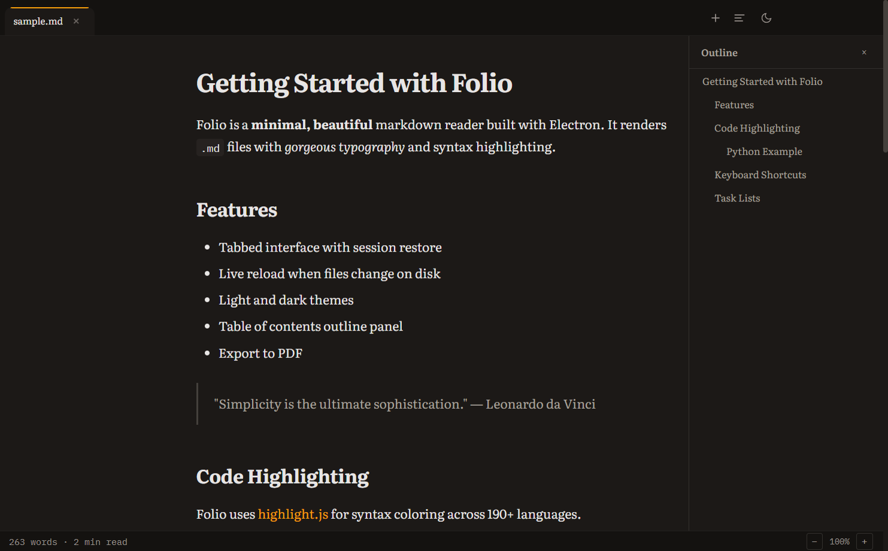
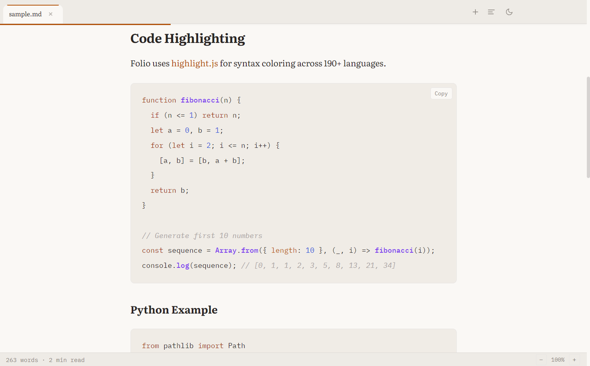

<p align="center">
  
</p>

<h1 align="center">Folio</h1>

<p align="center">
  A minimal, beautiful markdown reader.<br>
</p>

<p align="center">
  <a href="https://github.com/BharatBheesetti/Folio/releases">Download</a>&nbsp;&nbsp;&bull;&nbsp;&nbsp;<a href="#features">Features</a>&nbsp;&nbsp;&bull;&nbsp;&nbsp;<a href="#keyboard-shortcuts">Shortcuts</a>&nbsp;&nbsp;&bull;&nbsp;&nbsp;<a href="#build-from-source">Build</a>
</p>

<br>

<p align="center">
  
</p>

## Features

**Clean typography** - Warm color palette with dark mode

**Tabs** - Simple tabs. Open tabs are restored across restarts.

**Live reload** — Files auto-reload when changed on disk with scroll position preserved.

**Outline panel** — Auto-generated from headings for quick navigation through long documents.

**Syntax highlighting** — Fenced code blocks with language-aware colors and a one-click copy button.

**PDF export** — `Ctrl+P` to export any document as a styled PDF.

**Search** — `Ctrl+F` for in-document search with match highlighting.

**Status bar** — Word count and estimated reading time.

No editing. No bloat. Just reading, done well.

<details>
<summary>More screenshots</summary>

| Light mode | Dark mode |
|---|---|
|  |  |

| Outline panel | Code highlighting |
|---|---|
|  |  |

</details>

## Download

Grab the latest build from [**Releases**](https://github.com/BharatBheesetti/Folio/releases):

- **Windows** — `.exe` installer or portable
- **macOS** — `.dmg` (x64 and Apple Silicon)
- **Linux** — `.AppImage` or `.deb`

## Build from source

```bash
git clone https://github.com/BharatBheesetti/Folio.git
cd Folio
npm install
npm start
```

Build a portable `.exe`:

```bash
npm run build
```

Build an installer:

```bash
npm run build:installer
```

## Keyboard shortcuts

| Shortcut | Action |
|---|---|
| `Ctrl+O` / `Ctrl+T` | Open file |
| `Ctrl+W` | Close tab |
| `Ctrl+Tab` / `Ctrl+Shift+Tab` | Next / previous tab |
| `Ctrl+Shift+T` | Reopen closed tab |
| `Ctrl+F` | Search in document |
| `Ctrl+P` | Export to PDF |

## Security

All rendered HTML is sanitized via [sanitize-html](https://github.com/apostrophecams/sanitize-html) — no script injection, no iframes, no event handlers. Content Security Policy blocks inline scripts and all outbound network requests. Fonts are bundled locally (no CDN calls). DevTools are disabled in production builds. The IPC surface validates file extensions and prevents path traversal.

## Architecture

```
main.js       — Electron main process: window, IPC, markdown rendering, file watching
preload.js    — Context bridge: exposes a safe API surface to the renderer
renderer.js   — UI: tabs, themes, search, outline, session persistence
index.html    — Layout and styling (~250 lines of CSS)
fonts/        — Bundled Literata + IBM Plex Mono (WOFF2)
```

## Contributing

See [CONTRIBUTING.md](CONTRIBUTING.md).

## License

[MIT](LICENSE)
